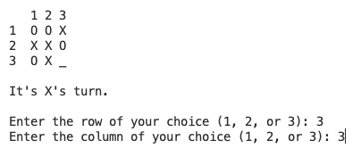
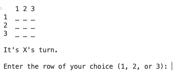

# Loops, Arrays, and Objects Review - Tic Tac Toe

**Table of Contents:**
- [App Overview](#app-overview)
  - [Starter Code](#starter-code)
- [TODOs](#todos)
  - [TODO 1: Complete the `printGrid` function](#todo-1-complete-the-printgrid-function)
  - [TODO 2: Refactor the `getNextMove()` call](#todo-2-refactor-the-getnextmove-call)
  - [TODO 3: Complete the](#todo-3-complete-the)


## App Overview

The game tic-tac-toe is about as classic as it gets. What we have here is a tic-tac-toe game that you can play in your terminal! 



The game currently works but there are a few key pieces missing. It's your job to fix it!

* The code you will be working with is in the `src/` directory.
* A solution can be found in the `solution/` directory.

The code for this project is split into two files:
1. `index.js` where the high-level program logic lives.
2. `helpers.js` where the helper functions that perform specific tasks live.

Without looking at the code, see how the game plays by running the command:

```sh
node solution
# equivalent to node solution/index.js
```

### Starter Code

Open up `src/index.js` to see the `main` function that contains the program's high-level logic. 

At the top of this function, the data needed for the game are set up inside of a single `game` object:
- `grid` — a 2D array representing the board. The first row and column of this 2D array act as the "headers" for the rows and columns. As such, positions within the grid begin at row 1, column 1 and end at row 3, column 3.
- `turn` — a string representing whose turn it is. Either `'X'` or `'O'`
- `spacesRemaining` — a number representing the remaining turns. It starts with `9` and will be decremented by `1` after each valid turn
- `winner` — a string representing the winner. It will be left as an empty string until someone wins. If it is still blank at the end of the game, we know that the game ended in a tie.

Below, the logic of the game unfolds as such:
* As long as there are remaining spaces AND we don't yet have a winner, do the following:
  * Show the state of the board in the terminal
  * Get the current player's next move (the row and column they wish to play their piece)
  * If their selection is valid...
    * ... place their piece (an `'X'` or an `'O'`) on the grid and check to see if they won
  * Repeat
* Once we either have run out of spaces or a player has won the game, the game ends and we see the result!

As you can see, most of the actual functionality is handled by the functions defined in the `src/helpers.js` file. Those functions are:
* `validateInput`
* `checkForWin`
* `playPieceAndCheckForWin`
* `getNextMove`
* `printGrid`
* `endGame`

Each of these functions accepts the `game` object as a parameter, giving them access to all of the game data. 

## TODOs

A few of these functions aren't working or could be improved. Run the program from the `src` directory to see what's wrong:

```sh
node src
# equivalent to node src/index.js
```

While the program is accepting inputs and seems to be playing the game, the first thing you'll notice is that the grid isn't being printed. Let's fix that

### TODO 1: Complete the `printGrid` function

In `src/helpers.js`, you'll see that the `printGrid` function is empty. It is your job to complete this function such that it prints out the `game.grid` 2D array in a nice format.

It should print out each row of the 2D array as a joined string. Like so:



You can also run `node solution` to see how we expect the output to look.

### TODO 2: Refactor the `getNextMove()` call

At this point, we can basically play the game. When the user enters a row and a column, it will be placed on the board by `getNextMove`. Take a look at that function to see how it works. 

Notice that `getNextMove` returns an array containing the selected `row` and `column`. This is the only reasonable way to return multiple values from a single function.

Back in `src/index.js`, we take that returned array, grab the `row` and `column` from indexes `0` and `1` respectively and then pass them along to `validateInput` and `playPieceAndCheckForWin`.

The code that we're using works but it can be improved. Since `getNextMove` returns an array, what can we do to simplify the extraction of the `row` and `col` values?

**<details><summary>Hint</summary>**
> Use destructuring!
</details>

### TODO 3: Complete the 

If you play the game and have someone win the game, you'll notice that the game doesn't end yet. In fact, the game always ends in a tie because it can't yet detect if someone has won.

Back in `src/helpers.js`, take a look at the `playPieceAndCheckForWin` function. This function is utilizing another helper function called `checkForWin` that is currently missing almost all of its logic.

The only code in there is a 2D array called `winningCombinations`. Here's how it works:
* Each array in `winningCombinations` represents a set of 3 positions in the grid that form a winning line. There are 8 possible winning combinations:
  * 3 combinations for winning across a single row
  * 3 combinations for winning down a single column
  * 2 combinations for winning along a diagonal
* Each position in an array is an object with a `row` and `column` property indicating a position in the grid. For example, the first winning combination array represents a win across row `1`:

    ```js
    // row 1 win
    [
      { row: 1, column: 1 }, 
      { row: 1, column: 2 }, 
      { row: 1, column: 3 }
    ], 
    ```

It is your job to use this `winningCombinations` array and the data in the `game` object to determine if the player who just played their piece (either an `'X'` or an `'O'`) completed one of these winning combinations.


A few hints:
* `game.grid` contains the current pieces in the grid. Each position in the grid will either have `'X'`, `'O'` or `'_'`.
* `game.turn` contains the last played piece, either `'X'` or `'O'`
* If a winner is determined, the function should set `game.winner = game.turn`.

If you need help with the algorithm, you can look at the suggested algorithm below.

**<details><summary>The algorithm</summary>**
> * For each possible winning combination...
>   * Get the value (`'X'` or `'O'`) at each position in the grid
>   * If they are all the same AND match `game.turn`...
>     * ...set `game.winner = game.turn`
>   * Otherwise, go to the next combination
</details>

